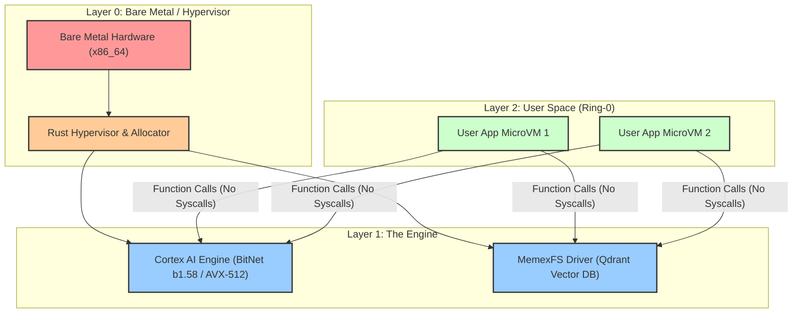

# NexusOS

> **The Hyper-Unikernel for the AI Era**

## The Paradigm Shift

**Traditional OS (Monolithic) vs. NexusOS (Hyper-Unikernel)**

In a traditional monolithic operating system like Linux or Windows, applications fight for resources through a heavy kernel layer. Processes, threads, context switches, and syscalls introduce significant latency and overhead. The OS is a general-purpose manager that treats high-performance AI workloads the same as a background update service.

**NexusOS** changes the game. It is not a Linux distribution. It is a Rust-based **Hyper-Unikernel** that runs applications as **JIT-compiled microVMs** directly in Ring-0. We have abolished processes. Instead, your application *is* the kernel, linked to a minimal "LibOS" that runs directly on the hypervisor. This architecture removes the barrier between your code and the hardware.

## Core Pillars

### 1. Zero-Latency MicroVMs
NexusOS leverages Firecracker-like isolation to achieve boot times of **under 50ms**. By stripping away the general-purpose bloat, each microVM contains only the exact code necessary to run its workload. No idle daemons, no unused drivers—just pure execution.

### 2. Cortex (AI Engine)
"Cortex" is our integrated, CPU-native AI engine. It is optimized for **BitNet b1.58 (1-bit LLMs)** and utilizes **AVX-512** instructions to deliver high-speed inference without requiring expensive GPUs. Cortex brings intelligence into the very fabric of the OS.

### 3. MemexFS (Semantic File System)
We have abandoned the archaic hierarchy of folders and files. **MemexFS** is built on a core **Vector Database (Qdrant)**. Data is retrieved by meaning and context, not by remembering an arbitrary path string. It is a file system designed for how humans think and how AI processes information.

## Architecture

## Why Use NexusOS?

### For Business
**Recall invoices by context, not filename.**
Forget searching through nested folders like `2023/Finance/Invoices/May`. With MemexFS, simply query "Unpaid invoices from vendor X last quarter," and the OS serves the exact microVMs and data points you need instantly.

### For Coders
**Dependency-free, container-native execution.**
Build your application, and NexusOS JIT-compiles it into a sealed, immutable microVM. No "it works on my machine" issues. No Docker overhead. Your code runs on bare metal speeds with perfect isolation.

### For Students
**Knowledge graphs instead of folder hierarchies.**
Organize your research, notes, and projects as a semantic web. Connect concepts naturally. Cortex can traverse your MemexFS to generate summaries and find connections between seemingly unrelated topics in your studies.
